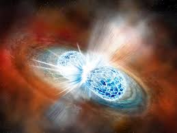
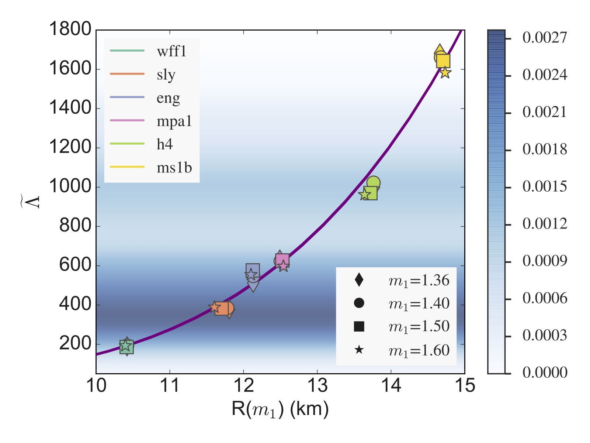
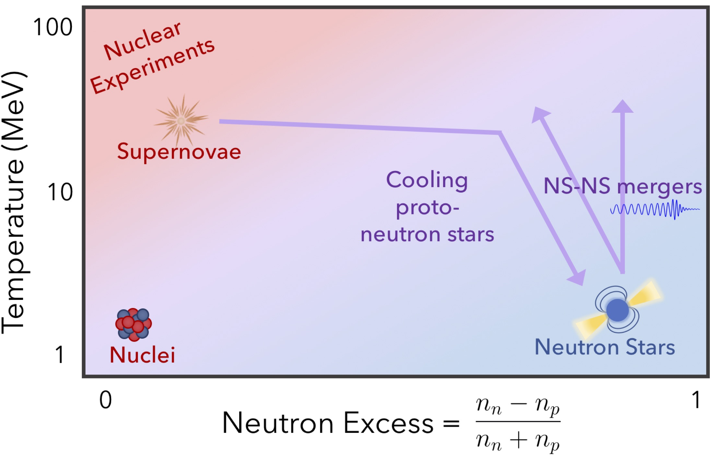

<!-- #### <b>Neutron stars</b>
*Neutron stars are really cool* -->

  

   <h4><b>Neutron stars</b></h4>
   

	Neutron stars are one of the most extreme environments in the universe. Their central densities exceed 1015 
	g/cm3, making them orders of magnitude more dense than any matter that we can 
	create on Earth. What happens when matter is compressed to such extreme densities is one of the biggest questions in
	modern nuclear physics. My research works to connect astrophysical observations of neutron stars with detailed models of the 
	stellar interior, in order to understand the fundamental nature of ultra-dense matter. This will in turn help astronomers
	better understand observations of a vast array of neutron star phenomena, from core-collapse supernovae, to neutron star merger
	and gamma-ray bursts.
   

   

   <html>
   <head>
   
   </head>
   <body>
   

   	 
         
 	 <!--<a href="../assets/merger_graphic.jpg">-->
	 

	    
	  
	  
	 Artistic representation of a NS-NS merger from Robin Dienel/Carnegie Institution for Science.
	 

	 <!--</a>-->
   

   </body>
   </html>

### <b>Recent results</b>

 

   <h4>Tidal deformability and NS radius</h4>
   

	In 2017, the LIGO/Virgo Collaboration observed the first gravitational wave signal from the merging of two neutron stars. 
	As part of this discovery, the collaboration was able to measure the <i>tidal deformability</i> of the neutron stars, which tells us
	how easy or difficult it is to rip a star apart.
	In analyzing this event, I discovered a new relationship that directly 
	connects the tidal deformability with the pre-merger stellar radius. Radii have been measured for several neutron stars; but 
	the 2017 event was the first ever measurement of a tidal deformability. This new relationship will allow us to
	directly compare existing radius measurements with new gravitational wave detections.
   

 

 

   
   
   

   
   Tidal deformability from GW170817 can directly probe the neutron star radius.
   <a href="https://iopscience.iop.org/article/10.3847/2041-8213/aabcbf">Raithel, Ozel, Psaltis (2018).</a>
   <a href="https://link.springer.com/article/10.1140%2Fepja%2Fi2019-12759-5">Raithel (2019).</a>
   

 

 

   <h4>Thermal effects in dynamical phenomena</h4>
    
    
   

   
   Range of temperatures and compositions probed by various terrestrial and astrophysical experiments.
   <a href="https://iopscience.iop.org/article/10.3847/1538-4357/ab08ea">Raithel, Ozel, Psaltis (2019).</a>
 

 

   

	When we model the interior structure of neutron stars, we can usually assume the star is "cold" -- that is, for old, 
	isolated, neutron stars, they have cooled enough that the thermal pressure is negligible. However, in extreme 
	enviroments, such as during the merging of two neutron stars or in the formation of a proto-neutron star 
	during a core-collapse supernova, the thermal effects become important again. Many previous simulations of mergers and
	supernovae relied on simplified physics to model these thermal effects, in order to keep the calculations tractable.
	We have created a new model of finite-temperature effects in dense-matter that includes more robust physics and
	remains generally applicable to a wide class of equations of state. This model will allow for more accurate studies of
	the role of thermal effects in neutron star mergers, core-collapse supernovae, and the cooling of proto-neutron stars.
   

 

<!-- [click here for the most recent version of the paper]({{ BASE_PATH}}/pages/working_papers/sample-working-paper.pdf) -->

<!-- Note: this is how to write a comment in HTML. Everything in here won't show up on your webpage.-->

<!--
To increase the size of the title, use fewer # in front of the paper title.
To decrease the size of the title, use more #. 
To remove the italics, remove the * before and after the description
To remove the underline from the title, remove the <u> tags (<u> and </u>)
-->
